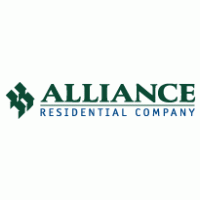
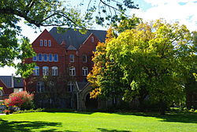

\ 

##Work

\

I am currently a Learning Manager at Alliance Residential Company based in Phoenix, Arizona. A few of my current duties include:

- Performing training needs assessments through a collaborative mix of surveys, interviews, and consultations
- Creating training curriculum and methods, online learning modules, and course materials
- Monitoring and evaluating training programs to ensure effectiveness and ROI
- Building out the content model strategy, existing and new models, while considering integration into the infrastructure strategy

I am looking forward to growing in the training and development field and am excited to use my analytical skills to contribute to the company and the discipline. 

\

##Education

I graduated in May 2018 from Macalester College in St. Paul, Minnesota, USA with a B.A. in Applied Mathematics and Statistics. 

I also was a 4 year starter and 2 year captain for the Macalester Scots baseball team. 

\ 

##Personal

In my spare time, I enjoy spending time with my family, hiking, trying new restaurants, going out for ice cream, attending Arizona Diamondbacks games, and playing baseball. I was born and raised in Arizona and will always consider the 48th state my home. 

